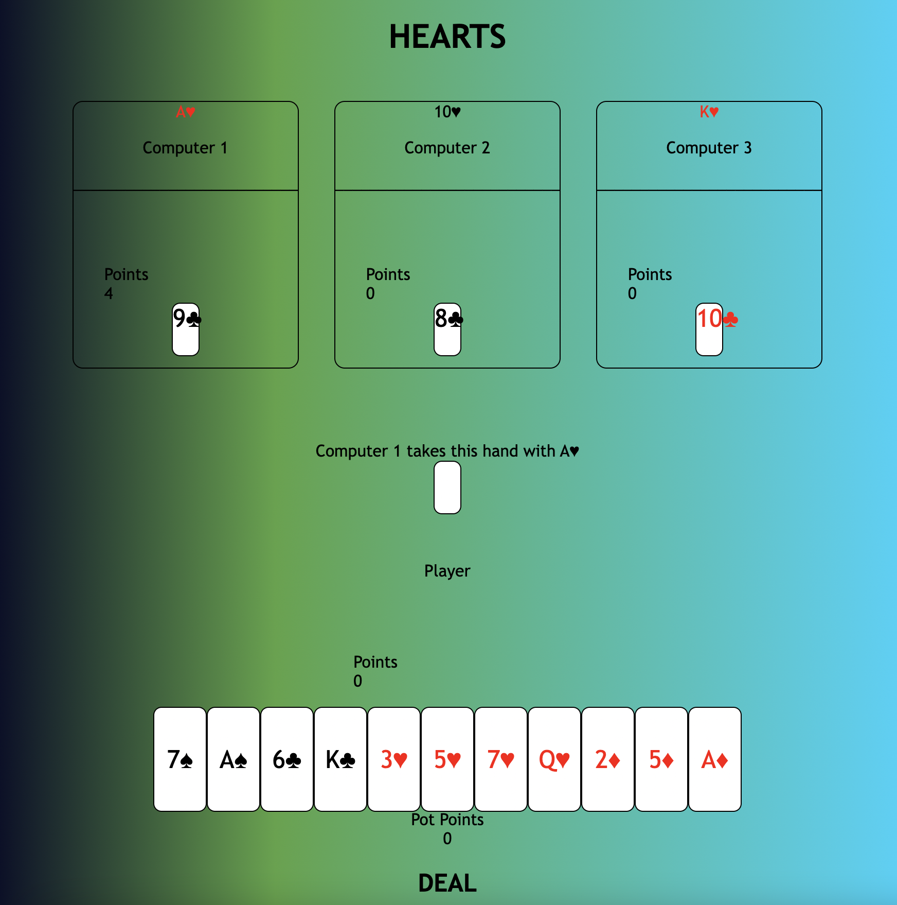

# HEARTS: THE CARD GAME

## Screenshots

## [Play](https://giantnerd123.github.io/Hearts-Card-Game/)

## Gameplay
The player holding the 2 of clubs after the pass makes the opening lead.

Each player must follow suit if possible. If a player is void of the suit led, a card of any other suit may be discarded. The highest card of the suit led wins a trick and the winner of that trick leads next. There is no trump suit.

## Features
* Plays one round of Hearts
* Fast-play
* Counts scores of all players

## To Do List
* Make gameplay continue until one player reaches 100 points
* Make the Queen of Spades worth 13 points
* Implement a "Breaking Hearts" function
* Add animations and details to cards so they look more exciting and stay on screen longer
* Add multi-player functionality
* Add sound effects and shuffle effects

## What I Used
* Javascript
* HTML
* CSS

## User Stories
* User can play any card at the start of a round
* User can play the same suit of the first card played by a computer from the round

## Features
* Plays one round of Hearts
* Fast-play
* Counts scores of all players

## Major Hurdles
* Allow each computer to play in turn, including at the start of a round
* Command each computer to play the initial suit of the round if available
* Determine the amount of hearts played in a hand and which player to give them to